# BotGo

QQ频道机器人，官方 GOLANG SDK。

[](https://pkg.go.dev/github.com/tencent-connect/botgo)
[](https://github.com/tencent-connect/botgo/tree/master/examples)

## 注意事项
1. websocket 事件推送链路将在24年年底前逐步下线，后续官方不再维护。
2. 新的webhook事件回调链路目前在灰度验证，灰度用户可体验通过页面配置事件监听及回调地址。如未在灰度范围，可联系QQ机器人反馈助手开通。


灰度期间，原有机器人仍可使用websocket事件链路接收事件推送。
## 一、quick start
### 1. QQ机器人创建与配置
1. 创建开发者账号，创建QQ机器人 [QQ机器人开放平台](https://q.qq.com/qqbot)

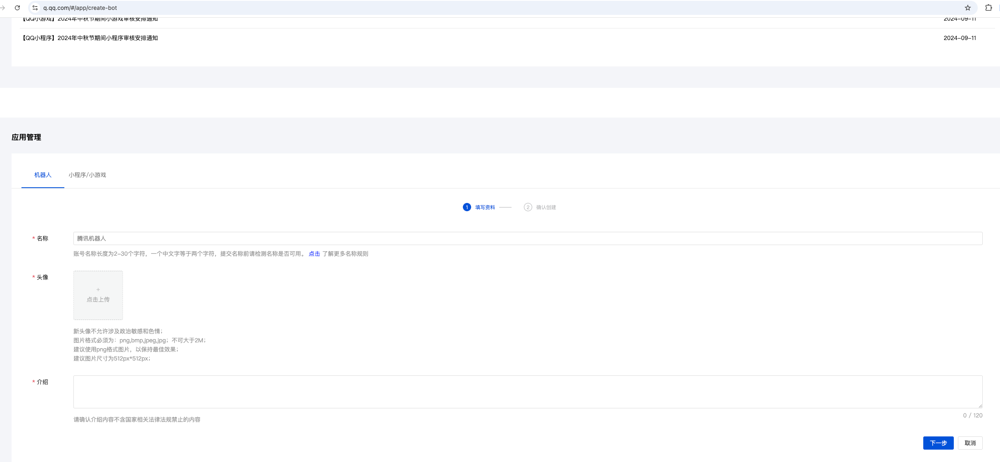

2. 配置沙箱成员 (QQ机器人上线前，仅沙箱环境可访问)。新创建机器人会默认将创建者加入沙箱环境。

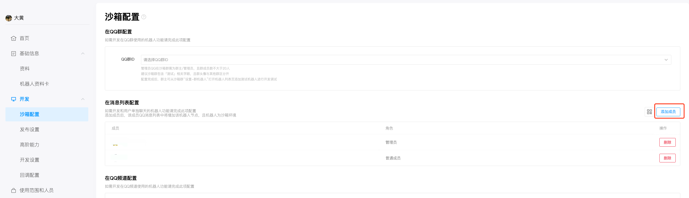

### 2. 云函数创建与配置
1. 腾讯云账号开通scf服务 [快速入门](https://cloud.tencent.com/document/product/1154/39271)
2. 创建函数

* 选择模板

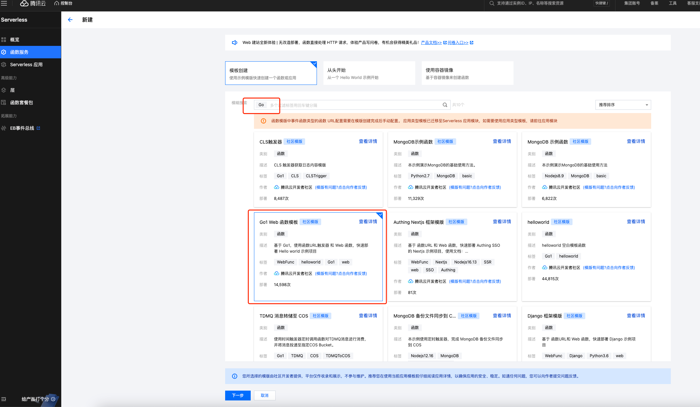

* 启用"公网访问"、"日志投递"

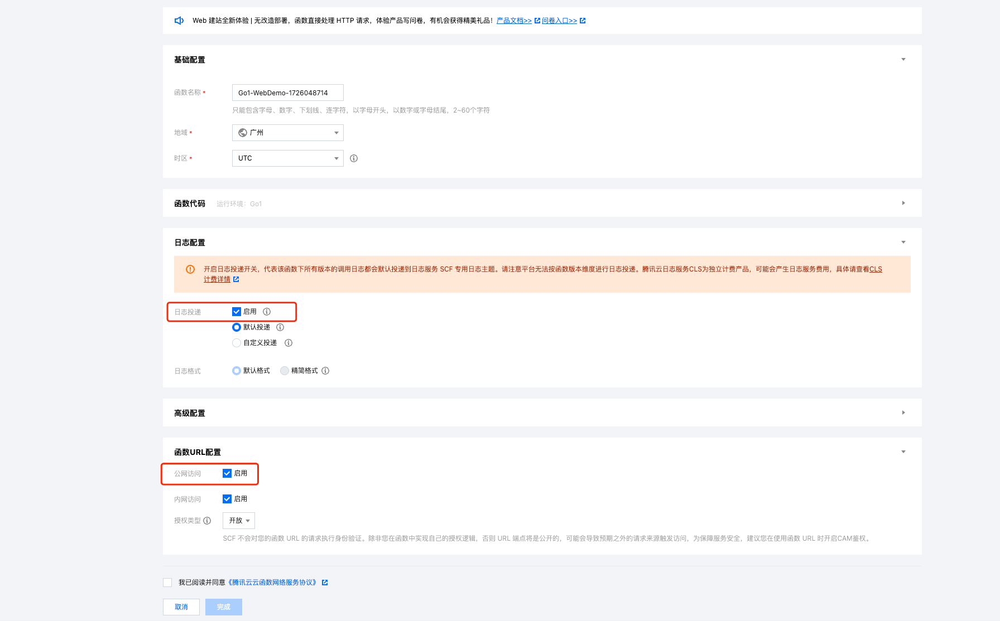

* 编辑云函数，启用"固定公网出口IP" （QQ机器人需要配置IP白名单，仅白名单内服务器/容器可访问OpenAPI）

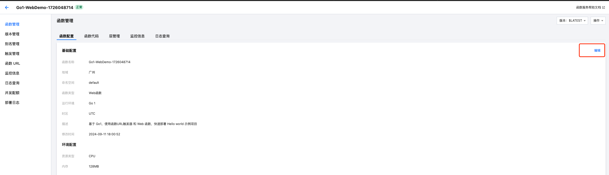

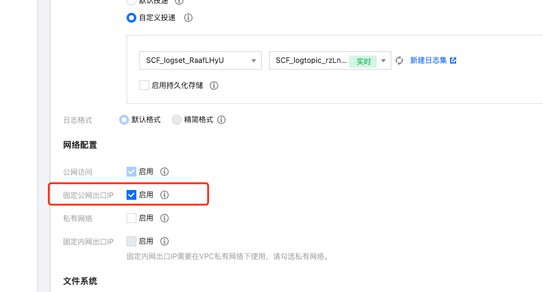

### 3. 使用示例构建、上传云函数部署包
1. 打开 examples/receive-and-send
2. 复制 config.yaml.demo -> config.yaml

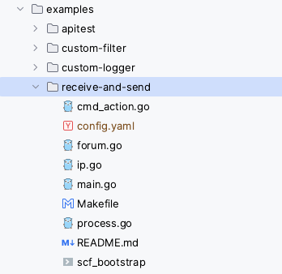

3. 登录[开发者管理端](https://q.qq.com)，将BotAppID和机器人秘钥分别填入config.yaml中的appid和secret字段


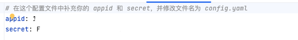

4. 执行Makefile中build指令
5. 将config.yaml、scf_bootstrap、qqbot-demo(二进制文件)打包，上传至云函数

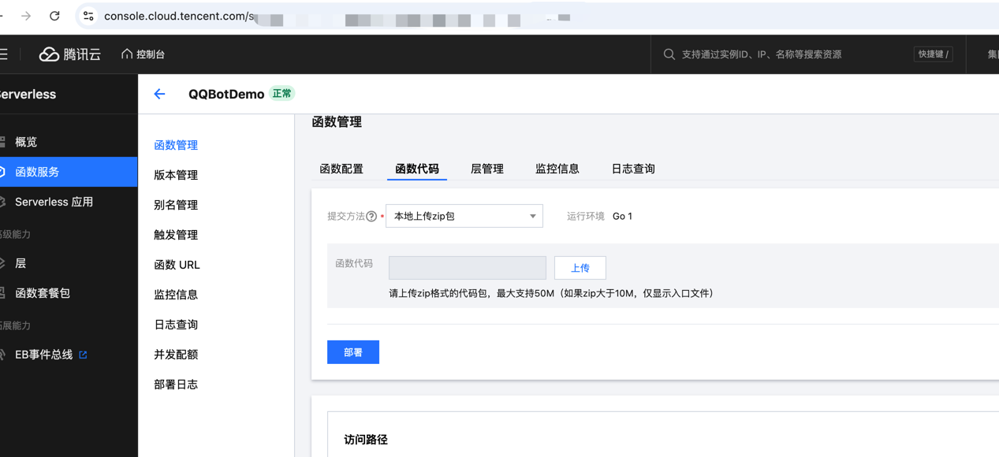

### 4.配置QQ机器人事件监听、回调地址、IP白名单

1. 复制云函数地址 + "/qqbot"后缀，填入回调地址输入框。点击确认。

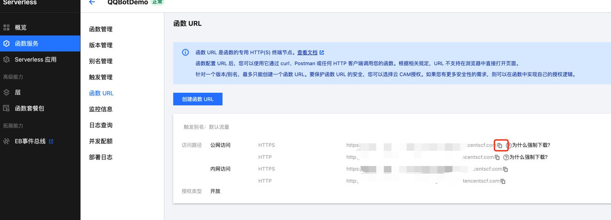

2. 勾选 C2C_MESSAGE_CREATE 事件。点击确认。

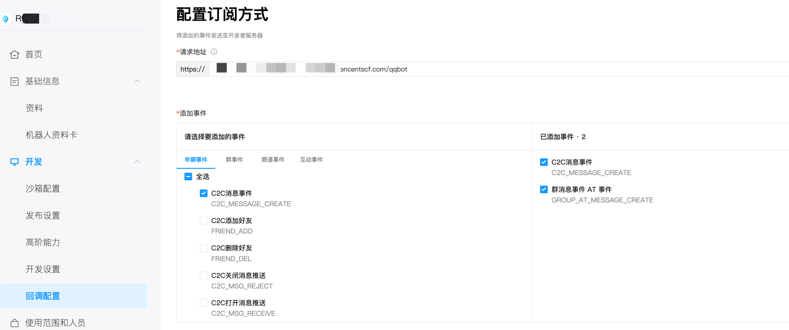


3. 将云函数 "固定公网出口IP" 配置到IP白名单中）

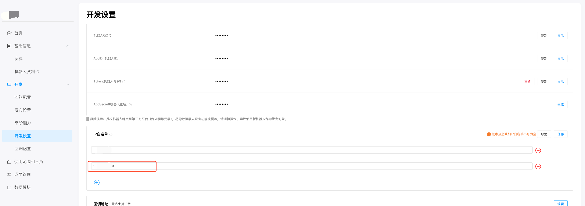

### 体验与机器人的对话

给机器人发送消息、富媒体文件，机器人回复消息

## 二、如何使用SDK

```golang

var api openapi.OpenAPI

func main() {
	//创建oauth2标准token source
	tokenSource := token.NewQQBotTokenSource(
		&token.QQBotCredentials{
			AppID:     "", 
			AppSecret: "",
		}) 
	//启动自动刷新access token协程 
	if err = token.StartRefreshAccessToken(ctx, tokenSource); err != nil {
		log.Fatalln(err)
	}
	// 初始化 openapi，正式环境 
	api = botgo.NewOpenAPI(credentials.AppID, tokenSource).WithTimeout(5 * time.Second).SetDebug(true) 
	// 注册事件处理函数 
	_ = event.RegisterHandlers( 
		// 注册c2c消息处理函数 
		C2CMessageEventHandler(), 
	)
	//注册回调处理函数 
	http.HandleFunc(path_, func (writer http.ResponseWriter, request *http.Request) {
		webhook.HTTPHandler(writer, request, credentials)
	}) 
	// 启动http服务监听端口 
	if err = http.ListenAndServe(fmt.Sprintf("%s:%d", host_, port_), nil); err != nil {
		log.Fatal("setup server fatal:", err)
	}
}

// C2CMessageEventHandler 实现处理 at 消息的回调
func C2CMessageEventHandler() event.C2CMessageEventHandler {
	return func(event *dto.WSPayload, data *dto.WSC2CMessageData) error {
		//TODO use api do sth.
		return nil
	}
}
```

## 三、SDK 开发说明 (Deprecated)

请查看: [开发说明](./DEVELOP.md)

## 四、加入官方社区

欢迎扫码加入 **QQ 频道开发者社区**。

